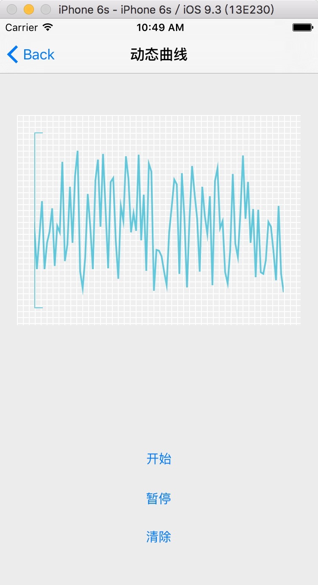

##曲线绘制(性能消耗的非常小)##
***
最近做项目，医疗的，当然就是要连硬件，同步测量数据了，都是些数据展示的东西，如下图，绘制血压、血氧的曲线



***

###接口###
***
```objc
/**
 *  @brief 最大显示值
 */
@property (nonatomic) CGFloat maxValue;

/**
 *  @author 嘴爷, 2016-02-25 16:02:06
 *
 *  @brief 添加点
 *
 *  @param numbers 数组样式[@(2), @(40), @(1836)]
 */
-(void)addValue:(NSArray<NSNumber*> *)numbers;

/**
 *  @author 嘴爷, 2016-02-26 10:02:26
 *
 *  @brief 清除曲线，回到初始状态
 */
-(void)clear;
```
####在控制器里使用####
```objc
#pragma mark -
#pragma mark - Action
//开始
- (IBAction)start:(UIButton *)sender {
    [self pause:nil];
    self.timer = [NSTimer scheduledTimerWithTimeInterval:0.1 target:self selector:@selector(addPoint:) userInfo:nil repeats:YES];
}

//暂停
- (IBAction)pause:(UIButton *)sender {
    [self.timer invalidate];
}

//清除
- (IBAction)clear:(UIButton *)sender {
    [self pause:nil];
    [self.curveView clear];
}

//添加点
-(void)addPoint:(NSTimer*)timer{
    NSMutableArray* array = [NSMutableArray array];
    for (int i = 0; i < 3; i++){
        [array addObject:@(arc4random() % 180 + 20)];
    }
    
    [self.curveView addValue:array];
}
```
