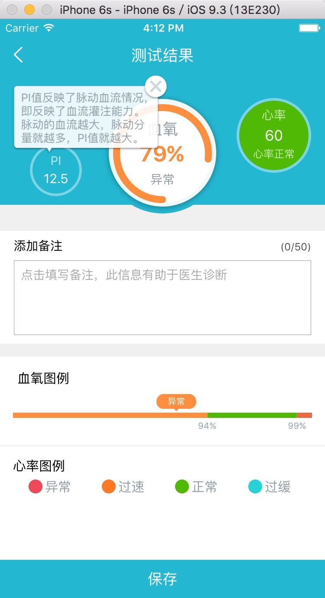
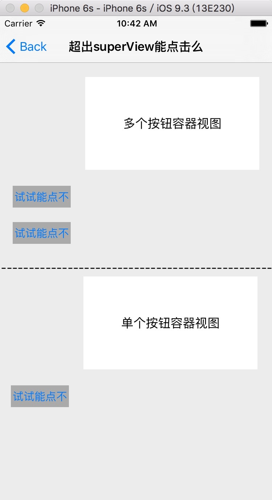
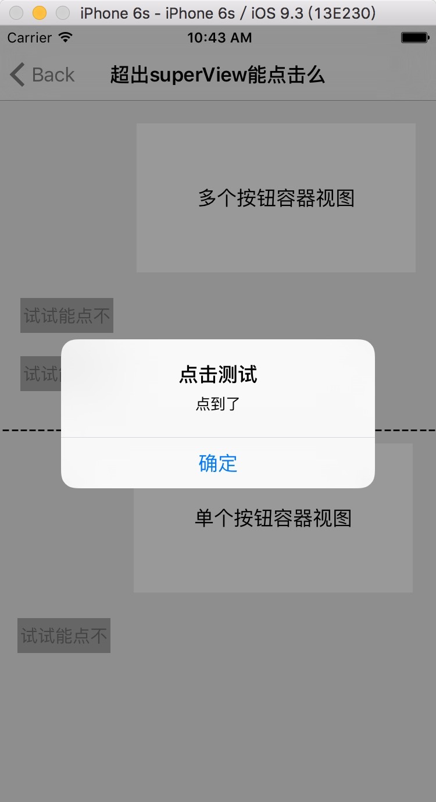

##超出视图外的控件能点击吗##
***
首先如下图



当点击'PI 12.5' 那个圆形按钮的时候，“”"弹出提示框。当然圆形按钮的位置肯定不是固定的，要考虑适配。那就是提示框加到什么地方合适，我这智商上称幺二两多，能想到的就是***提示框加到圆形按钮上***再合适不过了，不管你按钮跑哪，提示框在按钮上的位置是不变的。**问题又来了，超出按钮的提示框能响应事件么** 上面有个关闭按钮呢？也能，不过要重写一个方法，那就是view的一个方法
-(BOOL)pointInside:(CGPoint)point withEvent:(UIEvent *)event
下面我们打开一个工程去测试一下，如下图：



#####虚线下半部的一个按钮#####
***
***试试能点不*** 按钮
在白色容器上加了一个按钮，这个按钮显然超出的容器，如何上这个按钮能响应呢 ***试试能点不*** 按钮用容器的button属性可以访问的到，怎么样让这个按钮可以点击呢，要自定义这个容器(UIView)视图了，上代码：
```objc
-(BOOL)pointInside:(CGPoint)point withEvent:(UIEvent *)event{
    BOOL inside = [super pointInside:point withEvent:event];
    if (!inside) {
        CGPoint touchPoint = [self convertPoint:point toView:self];
        inside = CGRectContainsPoint(self.button.frame, touchPoint);
    }

    return inside;
}
```

***
***
#####虚线上半部分的多个按钮#####
***
多个***试试能点不*** 按钮
```objc
//答案很简单，重写下UIView的这个方法就行了，子视图即使超过了自己的边界也可以点击
-(BOOL)pointInside:(CGPoint)point withEvent:(UIEvent *)event{
    BOOL inside = [super pointInside:point withEvent:event];
    
    if (!inside) {
        CGPoint tempPoint = [self convertPoint:point toView:self];//将屏幕上的点转换到自己本身上
        for (UIView* view in self.subviews) {//遍历subViews
            if (CGRectContainsPoint(view.frame, tempPoint)) {//如果这个self上的这个点包含在子视图的frame内，就认为可以响应这个点击事件, 执行下面的代码
                inside = [view pointInside:[self convertPoint:point toView:view] withEvent:event];
                break;
            }
        }
        
    }
    
    return inside;
}
```


###看下效果###

